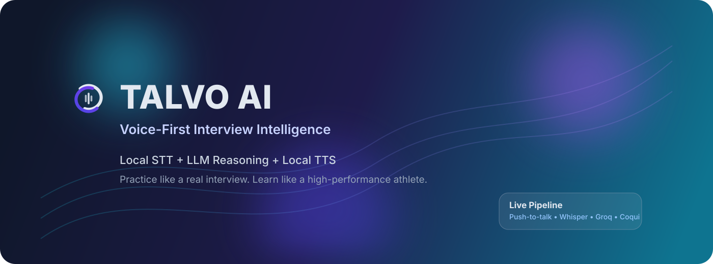



  

  

<h1 align="center">🚀 Talvo AI</h1>

  

  <a href="#-the-vibe"><strong>✨ Features</strong></a> ·
  <a href="#-system-architecture"><strong>🏗️ Architecture</strong></a> ·
  <a href="#-quick-start"><strong>⚡ Quick Start</strong></a> ·
  <a href="#%EF%B8%8F-environment-variables"><strong>⚙️ Config</strong></a> ·
  <a href="#-troubleshooting"><strong>🩺 Troubleshooting</strong></a>

  
  
  
  
   
  
  
  
  

 

## ✨ The Vibe

Talvo is built for candidates who want high-quality repetition under realistic interview pressure. It’s not just about practicing questions; it's about conversing with an AI that actively listens and coaches you.

<b>🎯 Dynamic Follow-Ups</b>

 
No generic scripts. The AI actively adapts to your answers, generating context-aware follow-up questions tailored specifically to what you just said.

<b>🎙️ Push-to-Talk Voice Loop</b>

 
Designed for natural speaking and precise input. Just like a walkie-talkie, providing you full control over when the AI listens.

<b>🔄 Replay-Ready Sessions</b>

 
Review stored interview sessions and turn-by-turn interactions anytime. Track your growth through detailed transcripts.

<b>💡 Instant Coaching</b>

 
Get real-time nudges and actionable feedback on the fly, empowering you to adjust and improve your next answer instantly.

<b>🧩 Aptitude & Technical Matches</b>

 
Not just behavioral! Specialized rounds including technical algorithms, system design, and rigorous aptitude quizzes.

 

## 🏗️ System Architecture

Talvo utilizes a dual-worker setup to handle realtime voice processing efficiently alongside typical web routing.

`mermaid
graph TD
    User([Candidate]) -->|Push-to-Talk Voice| Browser
    Browser -->|Audio Blob| STT
    
    subgraph "Python 3.13 - Django App"
        WEB[Web Server]
        Auth[OAuth & Session]
        Orch[Interview Orchestration]
        RAG[RAG + Prompt Eng]
    end
    
    subgraph "Python 3.11 - Speech Worker"
        STT[STT: faster-whisper]
        TTS[TTS: Coqui]
    end
    
    Browser <-->|HTTP / WebSocket| WEB
    WEB <--> Auth
    WEB <--> Orch
    Orch <--> RAG
    
    RAG <-->|Fetch context| Groq[Groq Llama LLM]
    STT -->|Transcribed Text| WEB
    Orch -->|Response Text| TTS
    TTS -->|Synthesized Audio| Browser
`

 

## 🧠 Intelligence Stack (Prompt Engineering & RAG)

Talvo runs a state-of-the-art **two-layer interviewer intelligence stack**:

1. **Prompt Engineering Layer:** Modular guidance by company, role, difficulty, and interview type.
2. **RAG (Retrieval-Augmented Generation) Layer:** Retrieves relevant interview examples from a local dataset and injects them into the LLM context.

### 🔍 How It Works

1. **Context Capture:** User context is captured from the interview setup form.
2. **Retrieval:** The retriever selects top-*k* relevant examples based on metadata + semantic context overlap.
3. **Prompt Assembly:** The builder constructs layered system rules combining standard guidelines and retrieved examples.
4. **Generation:** The Groq model generates a deeply grounded interviewer question plus concise coaching feedback.

<b>🛠️ Click to see Phase-2 Upgrades</b>

 

- **MMR-Style Reranking:** Enhanced diversity for candidate pool retrieval.
- **Configurable Weights:** Tune metadata and semantic weighting dynamically.
- **Diversity Control:** Avoid near-duplicate question retrieval in the same session.
- **Scenario Evaluator:** Built-in script for retrieval quality checks.

*Run the Evaluator:*
`powershell
Set-Location c:/TALVO/talvo
../.venv/Scripts/python.exe scripts/evaluate_rag_phase2.py
`

 

## ⚡ Quick Start

### 1. Prerequisites
- **Python 3.13** (for the Django web app)
- **Python 3.11** (for the Speech Worker)
- **Node.js** (for frontend UI components / Tailwind)

### 2. Setup Django App (Terminal A)

`powershell
Set-Location c:/TALVO/talvo
# Create and activate your 3.13 virtual environment if you haven't yet
c:/TALVO/.venv/Scripts/python.exe -m pip install -r requirements.txt
c:/TALVO/.venv/Scripts/python.exe manage.py migrate
c:/TALVO/.venv/Scripts/python.exe manage.py runserver 127.0.0.1:8000
`

### 3. Setup Speech Worker (Terminal B)

`powershell
Set-Location c:/TALVO/talvo
# Activate your 3.11 virtual environment (voiceenv311)
c:/TALVO/voiceenv311/Scripts/python.exe -m pip install -r speech_worker/requirements.txt
powershell -ExecutionPolicy Bypass -File scripts/start_speech_worker.ps1
`

### 4. Verify Services
Check if the speech worker is healthy:
`powershell
Invoke-WebRequest -UseBasicParsing http://127.0.0.1:8001/health | Select-Object -ExpandProperty Content
`

 

## ⚙️ Environment Variables

Copy .env.example to .env and fill in the required keys:

### 🔐 Required
`ini
GOOGLE_OAUTH_CLIENT_ID=your_client_id
GOOGLE_OAUTH_CLIENT_SECRET=your_client_secret
GROQ_API_KEY=your_groq_api_key
GROQ_MODEL_NAME=llama3-70b-8192
SPEECH_WORKER_URL=http://127.0.0.1:8001
`

<b>🎛️ Tuning Options (Optional)</b>

 

`ini
WHISPER_MODEL_SIZE=base
COQUI_TTS_MODEL=tts_models/en/ljspeech/vits
TTS_USE_GPU=0  # Recommended to keep 0 on most Windows setups unless CUDA is configured

# RAG Configuration
INTERVIEW_RAG_DATA_PATH=talvo1/data/interview_question_bank.json
INTERVIEW_RAG_TOP_K=4
INTERVIEW_RAG_CANDIDATE_POOL=12
INTERVIEW_RAG_ENABLE_RERANK=1
INTERVIEW_RAG_DIVERSITY_LAMBDA=0.20
INTERVIEW_RAG_METADATA_WEIGHT=1.0
INTERVIEW_RAG_SEMANTIC_WEIGHT=1.1
`

> **Note on OAuth Redirects:**
> Make sure to configure http://127.0.0.1:8000/accounts/google/login/callback/ and http://localhost:8000/accounts/google/login/callback/ in your Google Cloud Console.

 

## 🧭 Core Routes

### Web
- 🏠 **Landing:** GET /
- 🎯 **Dashboard:** GET /dashboard/
- 🎙️ **Live Interview:** GET /live-interview/
- 📊 **Feedback & Analytics:** GET /post-interview-feedback/

### API
- 🏁 **Start Interview:** POST /api/live-interview/start/
- 🔄 **Interview Turn:** POST /api/live-interview/turn/

 

## 🩺 Troubleshooting

<b>🔴 Connection refused on STT (WinError 10061)</b>

 

1. Ensure the Speech Worker is running before starting an interview turn.
2. Confirm the /health endpoint responds on port 8001.
3. Verify that SPEECH_WORKER_URL in your .env points to the correct host/port.

<b>🎤 Voice not captured</b>

 

- Keep the **Hold to Speak** button pressed actively while speaking.
- Release it **only after** you've finished your sentence.
- Check browser microphone permissions and OS input levels.

<b>🐌 Slow TTS / Coqui GPU issues</b>

 

- Leave TTS_USE_GPU=0 by default.
- Only enable GPU if you are certain your CUDA/cuDNN toolkit precisely matches PyTorch requirements in the oiceenv311 environment.

 

## 📜 License

Talvo is distributed under the terms in the [LICENSE](LICENSE) file.

 

<i>Made with  for better interviewing.</i>

